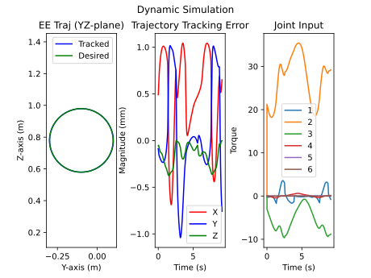

# mj_InvertedPendulum
Using Optimzation based Operational-Space Control to track the End-Effector position of the Double Pendulum.

https://user-images.githubusercontent.com/31178720/168519154-20d7033e-f9f5-4c7f-8034-27a0b3765db3.mov

# ur5 End-Effector Trajectory and Error
https://user-images.githubusercontent.com/31178720/173155531-2f44893d-58f9-4369-8661-9295d92476d2.mov

